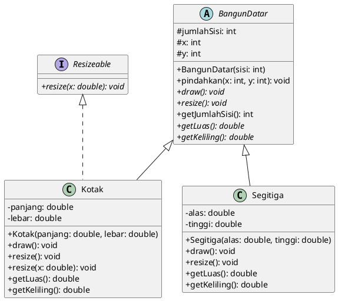
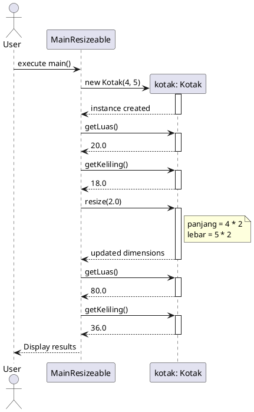

# UML Diagrams

## 1. Class Diagram

Diagram ini menggambarkan struktur kelas, interface, dan hubungan antar komponen.

## 2. Sequence Diagram

Diagram ini menggambarkan alur eksekusi pada `MainResizeable`.

